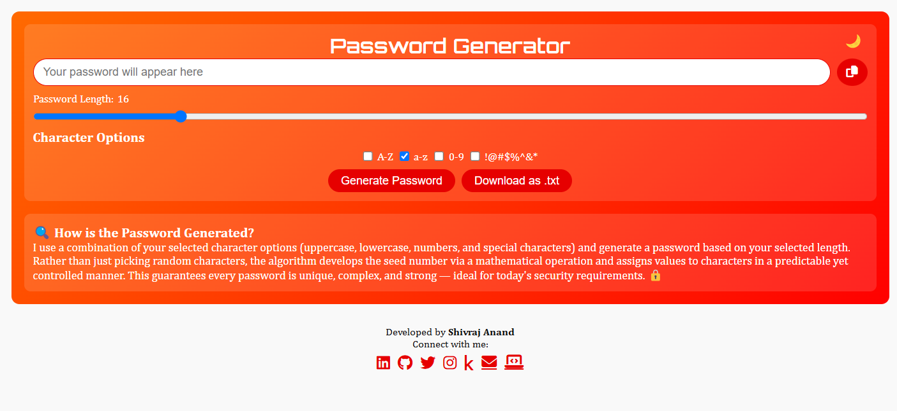

# 🔐 Password Generator Web App

A sleek and secure password generator built using **HTML, CSS, and JavaScript**. This app gives users full control over the structure of their password (uppercase, lowercase, digits, symbols) — and adds an extra layer of complexity through a **custom algorithm** based on a twisted Collatz sequence starting with a **random prime number**. 🧠⚡

---

## 🚀 Features

- ✅ Choose character types (uppercase, lowercase, numbers, symbols)
- 🔢 Customizable password length
- 🧬 Advanced randomness using a modified **Collatz sequence**
- 🔒 Generates strong, unique passwords every time
- 🌙 **Dark mode toggle**
- 📱 **Responsive design** — mobile-friendly, fits in a single screen
- 🧘 Minimalist & distraction-free user interface

---

## 🧠 How It Works

Instead of picking characters purely at random, this app starts with a **random prime number** and evolves it using a variation of the **Collatz sequence**. Each transformed number is then **mapped to a character** in a controlled yet pseudo-random way, ensuring:

- 🔁 Repeatability without repetition
- 🎲 High entropy
- 💪 Strong password structure

---

## 🖼️ Preview

 <!-- Replace with actual image path if available -->

---

## 🔧 Tech Stack

- **HTML5**  
- **CSS3 (Flexbox + Media Queries)**  
- **Vanilla JavaScript**

---

## 📦 How to Use

## 🔗 Connect with Me

- 🌐 Portfolio: [shivrajanand.github.io](https://shivrajanand.github.io)

